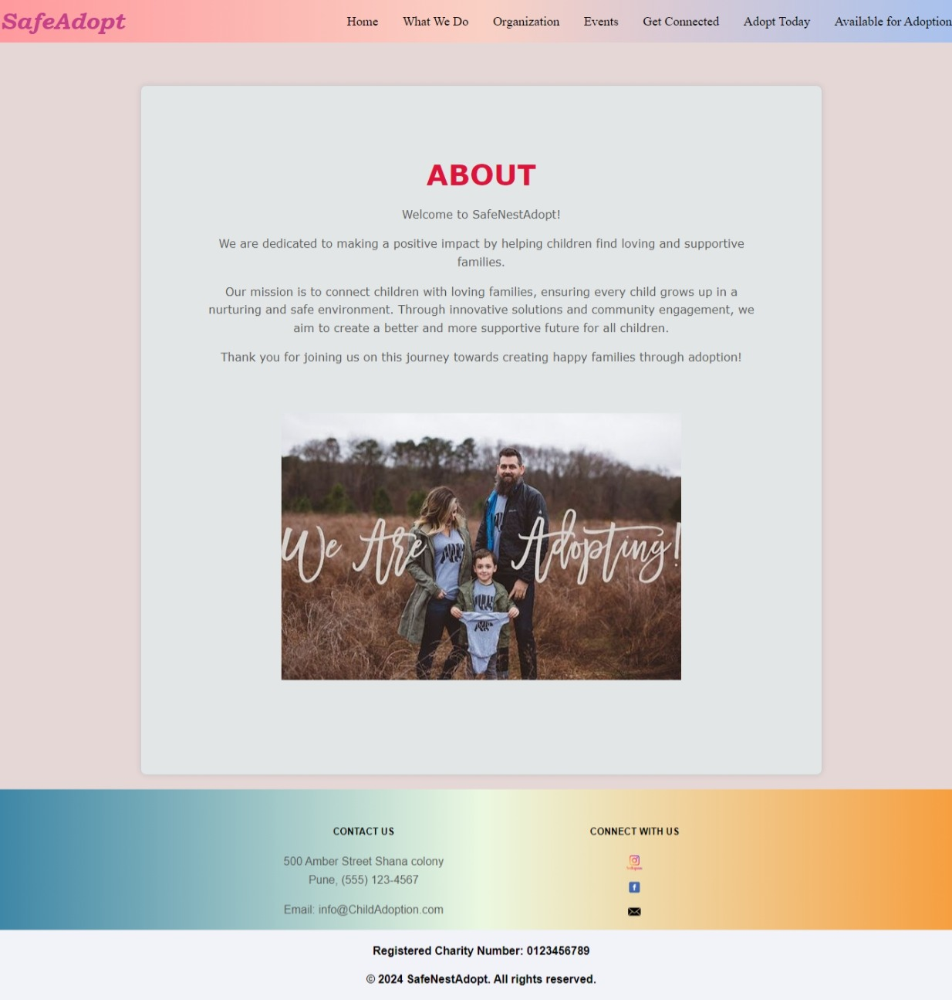

# Child Adoption System

This project is a Child Adoption System developed using HTML, CSS, Thymeleaf, Java Spring Boot, and MySQL. It provides an interface for users to view information about the adoption process, contact details, organization details, upcoming events, and to register for adoption. 

## Features

- **Home Page**: Introduction to the Child Adoption System.
- **About Us**: Information about the organization and its mission.
- **Contact**: Contact information and a form to reach out to the organization.
- **Organization**: Details about the organization.
- **Event**: Information about upcoming events.
- **Adoption Registration**: Form for users to register for adoption.
- **Details of Adoption**: Detailed information about the adoption process.

## Screenshots

### Home Page
[Home Page.jpeg
](https://github.com/RenukaKale29/Child_Adoption_Website/blob/6e4a086906a2da63b470b007fecd3de1c899624e/Event%20Page.jpeg)
### About Us Page


### Contact Page


### Organization Page


### Event Page


### Adoption Registration Page


### Details of Adoption Page


## Installation

1. **Clone the repository**:
    ```sh
    git clone[ https://github.com/yourusername/child-adoption-system](https://github.com/RenukaKale29/Child_Adoption_Website).git
    ```
2. **Navigate to the project directory**:
    ```sh
    cd child-adoption-system
    ```
3. **Setup the MySQL Database**:
    - Create a database named `child_adoption_system`.
    - Update the `application.properties` file with your MySQL username and password.
    ```properties
    spring.datasource.url=jdbc:mysql://localhost:3306/child_adoption_system
    spring.datasource.username=your_username
    spring.datasource.password=your_password
    ```
4. **Run the application**:
    ```sh
    mvn spring-boot:run
    ```

## Usage

- Open your web browser and navigate to `http://localhost:1003`.
- Explore the various pages and functionalities of the Child Adoption System.

## Contributing

If you would like to contribute, please fork the repository and use a feature branch. Pull requests are warmly welcome.

## License

This project is licensed under the MIT License.

